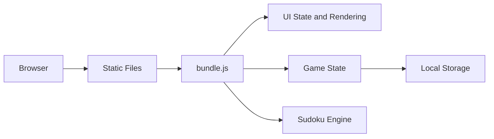
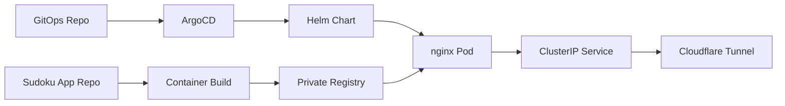

# Sudoku Studio Architecture

## Technology Stack

- Static HTML, CSS, and vanilla JavaScript.
- Node built-in test runner for unit tests.
- nginx container for homelab hosting.
- Helm chart consumed by ArgoCD from the GitOps repository.

The source is kept as small ES modules for readability and tests, then bundled
into `src/bundle.js` for browser delivery. This avoids runtime module-loading
surprises in locked-down mobile browsers while keeping the code reviewable.

## Runtime Architecture

## Modules

- `src/sudoku.js`: Sudoku generation, solver, uniqueness checks, conflicts, and
  peer calculations.
- `src/game-state.js`: game state transitions, notes mode, hints, timer state,
  reset, and local storage persistence.
- `src/app.js`: DOM rendering, start/game screen flow, controls, keyboard
  handling, and visual feedback.
- `src/bundle.js`: generated browser bundle produced by `npm run build`.
- `scripts/build-bundle.cjs`: small build script that combines the source
  modules into the browser bundle.

## Puzzle Generation

The generator creates a complete solved grid with randomized backtracking. It
then removes cells while checking that the puzzle still has a single solution.
Difficulty is controlled by target given-cell count.

## Deployment

The app is built into an nginx image and deployed by updating the image tag in
the GitOps repository. This keeps application code and cluster desired state on
separate release lifecycles.

## AI Tooling Used

- Cursor agent for planning, implementation, tests, documentation, and homelab
  deployment workflow.
- Human review for project direction, scope selection, and deployment choices.

## Design Decisions

- Use static assets to keep the challenge small and deployable as a simple image.
- Keep game logic independent from the DOM so it can be unit tested.
- Use a two-screen UI so difficulty selection and gameplay do not compete for
  space on mobile or desktop.
- Let CSS follow `prefers-color-scheme` instead of storing a manual theme flag.
- Avoid PWA/service-worker behavior for the demo because stale caches made UI
  iteration harder during testing.
- Serve a bundled browser script while preserving module source files for tests
  and review.
- Use `Recreate`-style thinking for future stateful apps, but this app itself is
  stateless and can roll freely.
- Keep the homelab deployment in the GitOps repository while this repository owns
  source, tests, and image builds.
